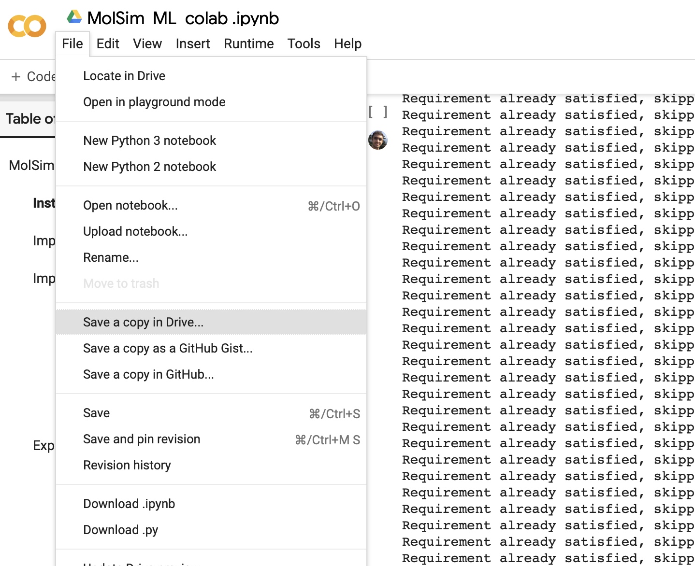

# ML workshop for MolSim 2021

[](https://colab.research.google.com/github/kjappelbaum/ml_molsim/blob/molsim2021/molsim_ml.ipynb)
[](https://mybinder.org/v2/gh/kjappelbaum/ml_molsim/molsim2021?filepath=molsim_ml.ipynb)
[](https://www.python.org/download/releases/3.7.0/)
[](https://opensource.org/licenses/MIT)
[](https://github.com/kjappelbaum/ml_molsim/actions)
[](https://doi.org/10.5281/zenodo.3605363)

In this exercise we will build a simple model that can predict the carbon dioxide uptake in MOFs. The goal is to get familiar with the tools that are used for machine learning and to develop an understanding of the workflow, tricks, and pitfalls (e.g., why baselines are important). Some more of the theory can be found [in our review](https://pubs.acs.org/doi/abs/10.1021/acs.chemrev.0c00004).


If you find some errors, typos or issues feel free to [open an issue](https://help.github.com/en/github/managing-your-work-on-github/about-issues) or directly make a [pull request](https://help.github.com/en/github/collaborating-with-issues-and-pull-requests/about-pull-requests).

# How to run it

If you have a modern laptop, we recommend you run them
on the laptop. If you do not want to use your machine or the cluster, you
can also run the exercises on Google Colab.

## Some tips

- If you are not with the Python data science stack, we can recommend you [some cheatsheets](https://www.utc.fr/~jlaforet/Suppl/python-cheatsheets.pdf).
- If you are not familiar with a function you can get help in a Jupyter notebook by going into the parentheses of a function and hitting SHIFT + ENTER, alternatively, you can just prepend a variable/function/library with `?`, e.g., `?str.replace()`
- The errors you'll run into are most likely some that someone else already encountered. If you copy/paste the error message into a search engine like Google you will often find the solution to your problem on a site like StackOverflow
- [Here](https://www.dataquest.io/blog/jupyter-notebook-tips-tricks-shortcuts/) are some nice tips/tricks for using Jupyter notebooks
- For plotting, we use the [holoviews library](https://holoviews.org/) as it is one of the simplest ways to create interactive figures in Python (it is a high-level interface to the [bokeh library](https://bokeh.org/)). You mind find the [Getting Started section of the documentation](https://holoviews.org/getting_started/) useful if you want to understand it better. I also found [this guide from Caltech](http://bebi103.caltech.edu.s3-website-us-east-1.amazonaws.com/2019a/content/lessons/lesson_03/intro_to_holoviews.html) useful.

## Run it locally (recommended)

The following steps assume that you use MacOS or some Linux flavor. If you use Windows, we recommend that you first install the [Windows Subsystem for Linux (WSL)](https://docs.microsoft.com/en-us/windows/wsl/install-win10).

Create a new folder and clone this repository (you need `git` for this, if you get a `missing command` error for `git` you can install it with `sudo apt-get install git`)

```bash
git clone --depth 1 https://github.com/kjappelbaum/ml_molsim.git
cd ml_molsim
```

We recommend that you create a virtual conda environment on your computer in which you install the dependencies for this exercise. To do so head over to [Miniconda](https://docs.conda.io/en/latest/miniconda.html) and follow the installation instructions there.

Then, use

```bash
conda env create -f environment.yml -n ml_molsim
```

You can activate this environment using

```bash
conda activate ml_molsim
```

After this you can start Jupyter Lab and select the `molsim_ml.ipynb` file from the file browser.

```(bash)
jupyter lab
```

Make sure that the notebook kernel runs in the correct environment:


If the environment name that is shown is different from "ml_molsim" you can click on it and select the correct one.

## Use it on Google Colab


Here, you can use relatively powerful computing resources (like [GPUs](https://en.wikipedia.org/wiki/Graphics_processing_unit) and [TPUs](https://en.wikipedia.org/wiki/Tensor_Processing_Unit)) from Google for free.
Click the "Open in Colab" button on the top, then make a copy of the notebook into your Google Drive, and run the first three cells to
install the dependencies.
Then you should be able to use the notebook in Colab.



**Make sure to make a copy into your Google Drive and work on this copy. And
not on the shared notebook!**

_Note:_ If you have a Google Account from your organization, e.g. university, you might
need to log out and use your personal account as many organizations block
third-party applications.

_Note:_ Google Colab also requires that you reload the JavaScript of holoviews in each plotting cell.
So, you have to start every cell with a holoviews plot with `hv.extension('bokeh')`

## Acknowledgements

We want to thank [Leopold Talirz](https://github.com/ltalirz) for incredibly valuable feedback and input during the initial phases of development.
We also want to thank Peter Alexander Knudsen for spotting typos, as well as [Prof. Tristan Bereau](https://github.com/tbereau) and all MolSim participant and TAs for feedback.
