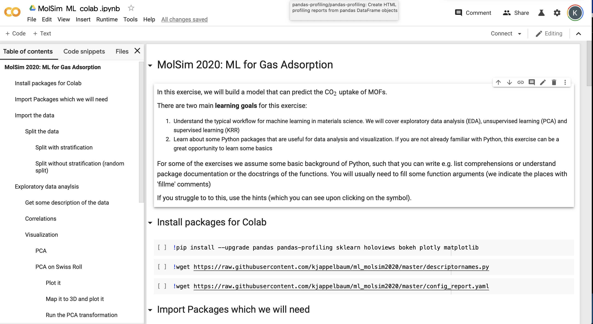
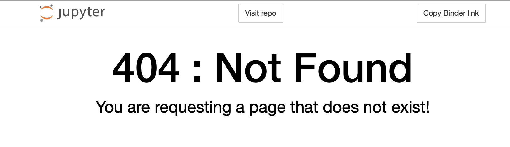

# ML workshop MolSim 2020

[](https://colab.research.google.com/drive/1jaRBPC3u-ianxiUGLsfZqMgYirEKfn_j)
[](https://mybinder.org/v2/gh/kjappelbaum/ml_molsim2020.git/master?filepath=molsim_ml)
[](https://www.python.org/download/releases/3.7.0/)
[](https://opensource.org/licenses/MIT)

In this exercise we will build a simple model that can predict the carbon dioxide uptake in MOFs.


# How to run it

Some parts of this exercise will need more computational resources than most of
the other MolSim exercises. If you have a modern laptop, we recommend you run them
on the laptop.
If you do not want to use your machine or the cluster, you
can also run the exercises on Google Colab or Binder.

### Run it locally (recommended)

First, you need to create a conda environment using the `environment.yml`
file we provide in this repository.

If you do not already have anaconda installed, head over to
https://docs.conda.io/en/latest/miniconda.html and install a python 3.7 version
for your operating system.

Then, create a new folder and clone this repository

```(bash)
git clone https://github.com/kjappelbaum/ml_molsim2020.git
cd ml_molsim2020
```

Now you can create a new conda environment.

```(bash)
conda env create --name molsim_ml --file=environment.yml
```

After this completed, active the environment and open the jupyter notebook

```(bash)
conda activate molsim_ml
jupyter notebook molsim_ml.ipynb
```

### Use it on Google Colab



Here, you can use relatively powerful computing resources from Google for free
(like GPUs and TPUs).
Click the "Open in Colab" button on the top and run the first three cells to
install the dependencies.
Then you should be able to use the notebook in Colab.

**Make sure to make a copy into your Google Drive and work on this copy. And
not on the shared notebook!**

_Note:_ If you have a Google Account from your organization, e.g. university, you might
need to log out and use your personal account as many organizations block
third-party applications.

### Use it on Binder

MyBinder is a free service to run interactively run jupyter notebooks from git repositories.
Compared to the Colab, computing resources are limited, and it can take some time
to start your instance.
Just click on the Binder button and wait for your instance to start.

_Note:_ If you encounter a 404 error (as shown below), click on the jupyter symbol and you will be redirected
to a file browser where you can select `molsim_ml.ipynb`.


## Join the competion on Kaggle 

We also host a [Kaggle competition](http://www.kaggle.com/c/molsim2020) for this exercise.

To join this competition, you need to create an account on www.kaggle.com. 
You can either drag and drop your solution `.csv` on the [submission
page](http://www.kaggle.com/c/molsim2020) or use the kaggle API. 

To use this, you need to export your username and a token. More details can be
found in [their repository](https://github.com/Kaggle/kaggle-api). 

```(bash) 
kaggle competitions submit -c molsim2020 -f submission.csv -m "Message"
```

Please share your code with a Kaggle notebook!


## Aknowledgments
We want to thank [Leopold Talirz](https://github.com/ltalirz) for incredibly valuable feedback. 